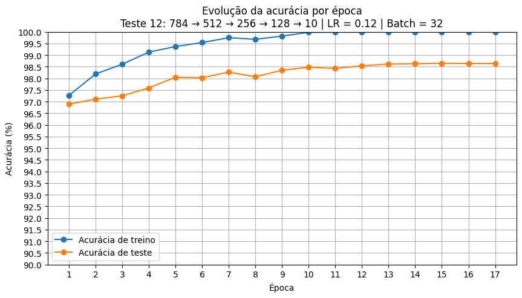
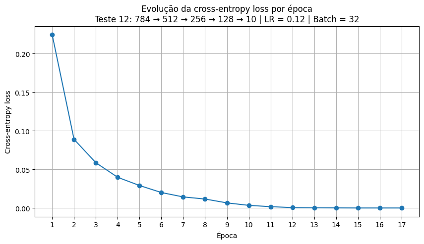

# Rede Neural MLP do Zero para Classificação do MNIST

## 1. Descrição do projeto

Este projeto implementa uma rede neural **MLP (Multilayer Perceptron)**
do zero para classificar dígitos manuscritos do dataset MNIST.

O objetivo principal foi compreender como uma rede neural realmente
funciona por dentro, sem utilizar modelos prontos do TensorFlow,
PyTorch ou Scikit-learn.

As principais etapas da rede foram implementadas manualmente com
NumPy:

- inicialização dos pesos e biases;
- forward pass;
- função de ativação ReLU;
- softmax na camada de saída;
- cross-entropy loss;
- backpropagation;
- atualização dos pesos com SGD;
- treinamento com mini-batches;
- acompanhamento da loss e da acurácia.

O Keras foi utilizado apenas para carregar o dataset MNIST. A lógica da
rede neural e do treinamento foi construída manualmente.

---

## 2. Objetivo

O objetivo do projeto foi implementar uma rede neural capaz de
classificar imagens de números escritos à mão.

Cada imagem possui:

```text
28 × 28 pixels
```
Após o tratamento dos dados, cada imagem é transformada em um vetor com:

```text
784 valores
```

A rede deve receber esse vetor e retornar 10 probabilidades: 

```text
0, 1, 2, 3, 4, 5, 6, 7, 8 e 9
```

A classe prevista corresponde à posição com maior probabilidade.

A meta mínima da atividade era atingir 92% de acurácia no conjunto de teste.

O melhor resultado obtido neste projeto foi 98,65% de acurácia.

## 3. Requisitos atendidos

| Requisito                                 | Implementado |
| ----------------------------------------- | ------------ |
| Rede neural MLP criada manualmente        | Sim          |
| Pelo menos duas camadas ocultas           | Sim          |
| ReLU nas camadas ocultas                  | Sim          |
| Softmax na saída                          | Sim          |
| Cross-entropy loss                        | Sim          |
| Backpropagation manual                    | Sim          |
| Otimizador SGD                            | Sim          |
| Learning rate configurável                | Sim          |
| Mini-batches configuráveis                | Sim          |
| Acurácia mínima de 92%                    | Sim          |
| Comparação entre diferentes configurações | Sim          |
| Gráficos de loss e acurácia               | Sim          |


## 4. Estrutura do projeto

```text
Rede_Neural/
├── mlp/
│   ├── __init__.py
│   ├── activations.py
│   ├── data.py
│   ├── losses.py
│   ├── network.py
│   └── optimizers.py
├── notebooks/
│   ├── experimentos.ipynb
│   └── train_mnist.py
├── results/
├── requirements.txt
└── README.md
```

### Arquivos principais

```text
| Arquivo                        | Responsabilidade                                                               |
| ------------------------------ | ------------------------------------------------------------------------------ |
| `mlp/activations.py`           | Implementa ReLU, derivada da ReLU e softmax                                    |
| `mlp/data.py`                  | Carrega, reorganiza e normaliza o dataset MNIST                                |
| `mlp/losses.py`                | Implementa a cross-entropy loss                                                |
| `mlp/network.py`               | Implementa a classe principal da MLP, incluindo forward pass e backpropagation |
| `mlp/optimizers.py`            | Implementa o otimizador SGD                                                    |
| `notebooks/train_mnist.py`     | Executa o treinamento da rede                                                  |
| `notebooks/experimentos.ipynb` | Documenta os testes, gráficos e conclusões                                     |
| `results/`                     | Armazena gráficos e imagens exportadas                                         |
```

## 5. Como a rede funciona

O fluxo completo do projeto é:
```text
imagem 28 × 28
    ↓
reshape para vetor com 784 pixels
    ↓
normalização dos valores entre 0 e 1
    ↓
camadas ocultas com ReLU
    ↓
camada final com softmax
    ↓
10 probabilidades
    ↓
classe com maior probabilidade
```

### 5.1 Normalização dos dados

Cada pixel originalmente possui um valor entre 0 e 255. Os valores são divididos por 255.0, após essa transformação, cada pixel fica entre 0 ou 1. Isso facilita o treinamento da rede.

### 5.2 ReLU

A função ReLU é aplicada nas camadas ocultas. Valores negativos são transformados em zero. Valores positivos são mantidos.

Exemplo:
```text
Entrada: [-3, -1, 0, 2, 5]
Saída:   [ 0,  0, 0, 2, 5]
```

### 5.3 Softmax

A softmax transforma os resultados da camada final em probabilidades.

Exemplo:
```text
Saída bruta:
[1.2, 0.5, 3.0]

Após softmax:
[0.13, 0.06, 0.81]
```
A soma das probabilidades é igual a 1. A rede escolhe a classe com maior probabilidade.

### 5.4 Cross-entropy loss

A loss mede o tamanho do erro da rede.

Quando a probabilidade da resposta correta é alta, a loss é pequena.

Quando a rede atribui baixa probabilidade à resposta correta, a loss é
maior.

Exemplo:
```text
Resposta correta com probabilidade de 95%:
loss baixa

Resposta correta com probabilidade de 5%:
loss alta
```

### 5.5 Backpropagation

O backpropagation calcula como cada peso contribuiu para o erro.

O processo ocorre no sentido contrário ao forward pass:
```text
erro da saída
    ↓
gradientes da última camada
    ↓
gradientes das camadas ocultas
    ↓
ajuste dos pesos
```

O gradiente informa quanto cada peso deve mudar e em qual direção ele deve mudar. 

### 5.6 SGD

O otimizador utilizado foi o SGD. A fórmula básica é:
```text
peso novo = peso antigo - learning rate × gradiente
```

O learning_rate controla o tamanho de cada atualização.

### 5.7 Mini-batches

As imagens não são processadas individualmente.

Elas são agrupadas em mini-batches.

Exemplo:
```text
batch size = 32
```

Nesse caso, a rede processa uma matriz com:

```text
32 imagens × 784 pixels
```

Depois calcula a média do erro e atualiza os pesos.

## 6. Arquitetura inicial

A primeira rede utilizada foi:
```text
784 → 128 → 64 → 10
```

Interpretação:
```text
784 entradas
    ↓
128 neurônios na primeira camada oculta
    ↓
64 neurônios na segunda camada oculta
    ↓
10 probabilidades de saída
```

Parâmetros do primeiro teste:

| Parâmetro                |               Valor |
| ------------------------ | ------------------: |
| Arquitetura              | 784 → 128 → 64 → 10 |
| Camadas ocultas          |                   2 |
| Learning rate            |                0.10 |
| Batch size               |                  64 |
| Épocas                   |                  10 |
| Seed                     |                  42 |
| Tempo aproximado         |         21 segundos |
| Melhor acurácia de teste |              97,94% |

Esse resultado já ficou acima da meta mínima de 92%.

## 7. Melhor configuração encontrada

Após diferentes experimentos, o melhor modelo encontrado utilizou:
```text
784 → 512 → 256 → 128 → 10
```
Interpretação:
```text
784 entradas
    ↓
512 neurônios na primeira camada oculta
    ↓
256 neurônios na segunda camada oculta
    ↓
128 neurônios na terceira camada oculta
    ↓
10 probabilidades de saída
```

| Parâmetro                |                      Valor |
| ------------------------ | -------------------------: |
| Arquitetura              | 784 → 512 → 256 → 128 → 10 |
| Camadas ocultas          |                          3 |
| Função de ativação       |                       ReLU |
| Ativação da saída        |                    Softmax |
| Função de erro           |         Cross-entropy loss |
| Otimizador               |                        SGD |
| Learning rate            |                       0.12 |
| Batch size               |                         32 |
| Épocas                   |                         17 |
| Seed                     |                         42 |
| Melhor época             |                         15 |
| Melhor acurácia de teste |                     98,65% |
| Tempo aproximado         |     1 minuto e 26 segundos |

A acurácia terminou próxima do melhor valor:

```text
Época 15 → 98,65%
Época 16 → 98,64%
Época 17 → 98,64%
```

## 8. Principais experimentos

O notebook notebooks/experimentos.ipynb documenta todos os testes em
detalhes.

A tabela abaixo resume os experimentos mais relevantes.

| Teste                   | Arquitetura                | Learning rate | Batch size | Épocas | Melhor acurácia |
| ----------------------- | -------------------------- | ------------: | ---------: | -----: | --------------: |
| Baseline                | 784 → 128 → 64 → 10        |          0.10 |         64 |     10 |          97,94% |
| Ajuste inicial do LR    | 784 → 128 → 64 → 10        |          0.11 |         64 |     30 |          98,17% |
| Redução do batch size   | 784 → 128 → 64 → 10        |          0.11 |         32 |     30 |          98,34% |
| Rede maior              | 784 → 512 → 256 → 10       |          0.11 |         32 |     13 |          98,44% |
| Terceira camada         | 784 → 512 → 256 → 128 → 10 |          0.11 |         32 |     13 |          98,55% |
| Ajuste fino do LR       | 784 → 512 → 256 → 128 → 10 |          0.12 |         32 |     17 |      **98,65%** |
| LR acima do ponto ideal | 784 → 512 → 256 → 128 → 10 |          0.13 |         32 |     17 |          98,62% |
| Batch size menor        | 784 → 512 → 256 → 128 → 10 |          0.12 |         24 |     17 |          98,50% |

## 9. O que funcionou bem

### 9.1 Redução do batch size de 64 para 32

A redução permitiu atualizações mais frequentes dos pesos e melhorou a
acurácia.

```text
Batch size 64 → 98,17%
Batch size 32 → 98,34%
```

### 9.2 Aumento gradual da arquitetura

Aumentar a largura da rede trouxe ganhos de acurácia.
```text
784 → 128 → 64 → 10
784 → 512 → 256 → 10
```

### 9.3 Inclusão de uma terceira camada oculta

Adicionar uma terceira camada oculta melhorou a capacidade da rede de
combinar padrões.

```text
784 → 512 → 256 → 10
784 → 512 → 256 → 128 → 10
```

A acurácia subiu!

### 9.4 Ajuste fino do learning rate

O learning rate de 0.12 apresentou o melhor resultado.

```text
LR = 0.11 → 98,55%
LR = 0.12 → 98,65%
```

## 10. O que não funcionou tão bem

### 10.1 Batch sizes muito pequenos

Reduzir demais o mini-batch tornou o treinamento mais instável.
```text
Batch size = 16
Batch size = 24
```

Com lotes menores, cada atualização passa a depender mais das
particularidades daquele grupo de imagens.

Isso causou oscilações na loss e piorou a acurácia de teste.

### 10.2 Muitas camadas ocultas

Adicionar uma quarta camada oculta aumentou o tempo de treinamento, mas
não melhorou a acurácia.

```text
784 → 512 → 256 → 128 → 64 → 10
```

A rede ficou mais complexa e mais instável.

### 10.3 Learning rate acima do ponto ideal

Aumentar o learning rate de 0.12 para 0.13 deixou o treinamento
mais rápido, mas reduziu levemente a acurácia.

```text
LR = 0.12 → 98,65%
LR = 0.13 → 98,62%
```

### 10.4 Aumentar excessivamente o número de neurônios

Uma rede mais larga atingiu uma loss muito pequena, mas não superou a
melhor acurácia.

Isso mostrou que reduzir a loss não garante automaticamente uma melhora
na capacidade de classificar imagens novas.

## 11. Principais aprendizados

- Durante os testes, foi possível observar que:

- loss menor não significa necessariamente acurácia de teste maior;

- redes maiores não são automaticamente melhores;

- aumentar a profundidade ajuda até certo ponto;

- batch sizes muito pequenos podem deixar o treinamento instável;

- learning rates muito altos podem causar oscilações;

- a acurácia de treino pode chegar a 100% sem que a acurácia de teste continue aumentando;

- alterar uma variável por vez facilita a interpretação dos resultados;

- o melhor modelo não é necessariamente o maior modelo;

- o custo computacional deve ser comparado com o ganho real de acurácia.

## 12. Gráficos

Os gráficos foram gerados com Matplotlib e exportados para a pasta results.

O notebook contém:

- curvas de acurácia de treino;
- curvas de acurácia de teste;
- curvas de loss;
- comparações entre learning rates;
- comparações entre batch sizes;
- comparações entre arquiteturas;
- análises das decisões tomadas em cada experimento.

Exemplos dos gráficos finais:





## 13. Como executar o projeto
### 13.1 Criar um ambiente virtual

Na raiz do projeto:
```bash
python3 -m venv .venv
```

Ative o ambiente:
```bash
source .venv/bin/activate
```

### 13.2 Instalar as dependências

```bash
python3 -m pip install -r requirements.txt
```

### 13.3 Rodar o treinamento

A partir da raiz do projeto:
```bash
PYTHONPATH=. python3 notebooks/train_mnist.py
```

## 14. Dependências

O arquivo requirements.txt deve conter:
```text
numpy
keras
tensorflow-cpu
matplotlib
```
O TensorFlow e o Keras foram utilizados somente para carregar o dataset
MNIST.

A rede neural foi implementada manualmente com NumPy.

## 15. Conclusão

A implementação atingiu o objetivo proposto.

A meta mínima era 92% e chegamos para 98,65% de acurácia.

O desenvolvimento mostrou que a qualidade do modelo depende de um
equilíbrio entre:

```text
arquitetura
learning rate
batch size
quantidade de épocas
tempo de treinamento
estabilidade
capacidade de generalização
```
O melhor modelo encontrado foi 784 → 512 → 256 → 128 → 10 

com: 
```text
Learning rate: 0.12
Batch size: 32
Épocas: 17
Melhor época: 15
Acurácia máxima de teste: 98,65%
```